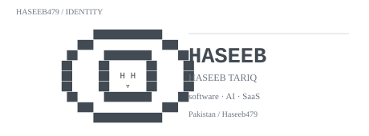

<!-- Haseeb479 / GitHub profile -->

  

[github](https://github.com/Haseeb479) &nbsp;·&nbsp;
[portfolio](https://github.com/Haseeb479/myPortfolio) &nbsp;·&nbsp;
[repositories](https://github.com/Haseeb479?tab=repositories)

> Software developer focused on AI, SaaS, automation, and product engineering. 
> I build practical systems where reliability matters as much as intelligence.

I work across **AI-powered applications, business software, automation, and full-stack systems**. Right now that includes [Foodio / Restaurant Bot](https://github.com/Haseeb479/restaurant-bot) — a multi-tenant restaurant ordering platform — and an [AI-Native Finance ERP](https://github.com/Haseeb479/AI-Native-Finance-ERP) built around deterministic accounting and AI-assisted workflows.

<samp>laravel &nbsp; php &nbsp; node.js &nbsp; typescript &nbsp; javascript &nbsp; python &nbsp; react &nbsp; next.js &nbsp; postgresql &nbsp; mysql &nbsp; docker &nbsp; git &nbsp; ai / llms</samp>

**[restaurant-bot](https://github.com/Haseeb479/restaurant-bot)** &nbsp;·&nbsp; <samp>laravel, node.js, whatsapp, groq, mysql</samp> 
Multi-tenant restaurant ordering platform with owner dashboards, order tracking, 
WhatsApp automation, AI conversation, menu OCR, and restaurant management.

**[AI-Native-Finance-ERP](https://github.com/Haseeb479/AI-Native-Finance-ERP)** &nbsp;·&nbsp; <samp>laravel, next.js, postgresql, redis, ai</samp> 
Pakistan-first finance and ERP architecture combining double-entry accounting, 
AP/AR, reconciliation, OCR, workflow automation, and an AI interaction layer.

**[RMS](https://github.com/Haseeb479/RMS)** &nbsp;·&nbsp; <samp>next.js, node.js, postgresql, prisma, groq</samp> 
AI recruitment and applicant-tracking system with candidate matching, analytics, 
event-driven notifications, career portals, and digital offer workflows.

**[Projects-in-ML](https://github.com/Haseeb479/Projects-in-ML)** &nbsp;·&nbsp; <samp>python, machine learning</samp> 
Machine-learning project work, experiments, and applied model development.

  

  

<samp>AI systems &nbsp;·&nbsp; SaaS architecture &nbsp;·&nbsp; automation &nbsp;·&nbsp; reliable business software</samp>

Every graphic here is generated locally inside this repository — no external stats service. 
The profile statistics and activity graphics are drawn from the GitHub GraphQL API 
by a scheduled GitHub Action, while the README itself stays lightweight and readable.

The visual system intentionally follows the reference's **monospace / terminal / data-graphic language**: 
SVG section headings, animated reveals, contribution visualisation, language breakdowns, 
and a character-based yearly activity map. The identity, projects, descriptions, and data are Haseeb's.

The repository keeps the profile configuration in [profile.config.json](profile.config.json), 
so the visible identity and featured projects can be updated without rewriting the whole README.

Haseeb Tariq · Haseeb479 · building software that solves real problems.

