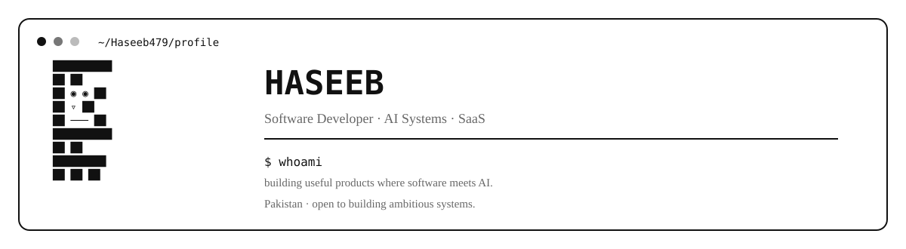
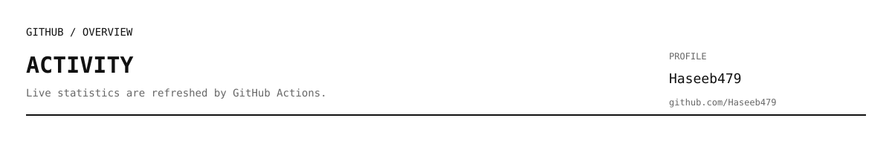
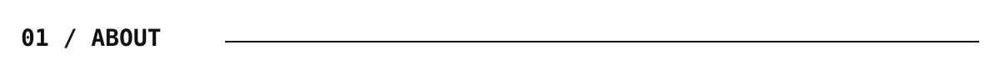
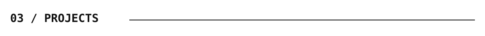
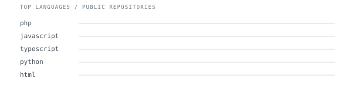
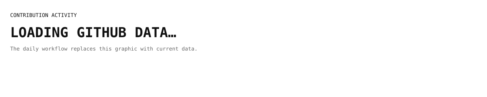
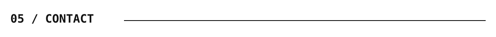

 

 

<a href="https://github.com/Haseeb479">GitHub</a>
&nbsp;·&nbsp;
<a href="https://github.com/Haseeb479/myPortfolio">Portfolio</a>
&nbsp;·&nbsp;
<a href="https://github.com/Haseeb479?tab=repositories">Repositories</a>

 

I build practical software products with a focus on **AI, automation, SaaS architecture, and reliable workflows**.

My work currently spans restaurant automation, AI-native finance/ERP systems, recruitment software, and machine-learning projects.

> **Build systems that work first. Make them intelligent second.**

 

`Laravel` · `PHP` · `Node.js` · `TypeScript` · `Python` · `React` · `Next.js` · `PostgreSQL` · `MySQL` · `AI / LLMs`

 

| Project | What it is |
|---|---|
| [Foodio / Restaurant Bot](https://github.com/Haseeb479/restaurant-bot) | Multi-tenant restaurant ordering platform with Laravel dashboards and a Node.js WhatsApp AI ordering bot. |
| [AI-Native Finance ERP](https://github.com/Haseeb479/AI-Native-Finance-ERP) | Finance/ERP architecture combining deterministic accounting with AI-assisted workflows and automation. |
| [RecruitPro RMS](https://github.com/Haseeb479/RMS) | Recruitment and ATS platform with AI matching, analytics, notifications, and career workflows. |
| [Machine Learning Projects](https://github.com/Haseeb479/Projects-in-ML) | Machine-learning experiments and project work. |

 

 

[GitHub](https://github.com/Haseeb479) · [Portfolio](https://github.com/Haseeb479/myPortfolio)

 

<b>About this page</b>

 

This profile is generated as a small, self-contained GitHub profile system.

- GitHub activity is refreshed automatically.
- Statistics are generated from GitHub's GraphQL API.
- SVG graphics keep the profile lightweight and GitHub-friendly.
- The visual language uses a terminal-inspired monochrome style.
- Project information is maintained in `profile.config.json`.
- The workflow only commits generated files when their contents actually change.

Built with code, curiosity, and too many terminal windows.

